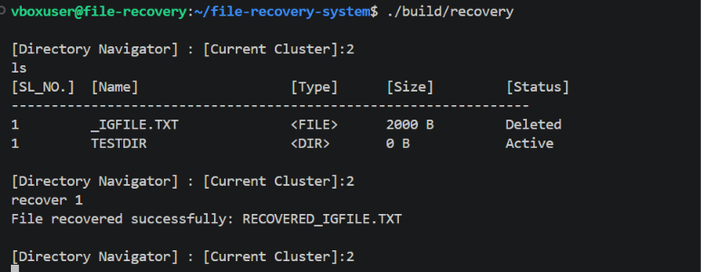

<div align="center">

# FAT32 File Recovery System

> A read-only file recovery utility built in C++ for navigating FAT32 disk images, detecting deleted files, and recovering files using their directory metadata.

</div>

---

## Preview

<p align="center">
  
</p>

---

## Features

- FAT32 filesystem metadata parsing
- FAT table and cluster-chain traversal
- Directory navigation
- Deleted file detection
- Deleted file recovery using directory metadata
- Multi-cluster file recovery
- Interactive command-line navigator
- Recovered files stored separately from the original image

---

## Stack

### Core

* C++
* FAT32 Filesystem
* Standard C++ Library

### Tools

* CMake
* GCC / G++
* Linux
* VirtualBox
* FAT32 disk images

---
## How to Run

### Prerequisites

Make sure the following are installed:

* CMake
* GCC / G++
* Linux environment

### Build

Clone the repository and navigate to the project directory:

```bash
git clone <repository-url>
cd file-recovery-system
```

Create a build directory and compile the project:

```bash
mkdir build
cd build
cmake ..
make
```

### Run

From the project root, run the compiled executable:

```bash
./build/<executable-name>
```

The program will open the FAT32 disk image and launch the interactive command-line navigator.

### Using a FAT32 Image

Place the FAT32 disk image in the project root and make sure the filename matches the one expected by the program:

```text
file-recovery-system/
├── fat32.img
├── recovered/
└── ...
```

The utility operates in **read-only mode**, so the original disk image is not modified. Recovered files are written to the `recovered/` directory.

### Example

```bash
mkdir build
cd build
cmake ..
make
cd ..
./build/<executable-name>
```


## Project Structure

```text
file-recovery-system/
│
├── main.cpp                    # Program entry point
├── FAT32_Nav.cpp               # Interactive directory navigation
├── FAT32_BPB.cpp               # BPB parsing and filesystem offsets
├── FAT32_FAT.cpp               # FAT cluster chain handling
├── FAT32_Dir.cpp               # Directory parsing and traversal
├── FAT32_Recovery.cpp          # Deleted file recovery logic
│
├── common/
│   ├── FAT32_BPB.h             # FAT32 BPB definitions
│   ├── FAT32_FAT.h             # FAT table interface
│   ├── FAT32_Dir.h             # Directory entry definitions
│   ├── FAT32_Recovery.h        # File recovery interface
│
├── CMakeLists.txt              # Build configuration
├── fat32.img                   # FAT32 disk image
│                               
├── src/                        # Folder for preview image
└── recovered/
    └── ...                      # Recovered files
